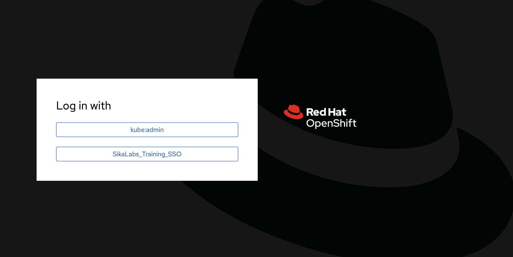

[Ondrej Sika (sika.io)](https://sika.io) | <ondrej@sika.io>

# OpenShift Training / OKD Training

## Course

## Kubernetes Training Repository

OpenShift is a distribution of Kubernetes, so many things are same or similar to Kubernetes.

We will use [kubernetes-training](https://github.com/ondrejsika/kubernetes-training) repository lots of examples as well.

```
https://github.com/ondrejsika/kubernetes-training
```

## About Me - Ondrej Sika

**Freelance DevOps Engineer, Consultant & Lecturer**

- Complete DevOps Pipeline
- Open Source / Linux Stack
- Cloud & On-Premise
- Technology stack
  - Git, Gitlab, Github
  - Gitlab CI, Github Actions
  - Docker, Kubernetes, OpenShift
  - Prometheus, Grafana, Loki, ElasticStack
  - Terraform, Ansible
  - Azure, AWS, VMware, Proxmox

## Star, Create Issues, Fork, and Contribute

Feel free to star this repository or fork it.

If you found bug, create issue or pull request.

Also feel free to propose improvements by creating issues.

## Chat

For sharing links & "secrets".

- Campfire - https://sika.link/join-campfire
- Slack - https://sikapublic.slack.com/
- Microsoft Teams
- https://sika.link/chat (tlk.io)

## DevOps Kniha (Czech only)

[](https://kniha.sika.io)

<https://kniha.sika.io>

## Connect Lab VM

Open VS Code in the browser (i recommend using Google Chrome): on `https://codeX.sikademo.com` where `X` is your instance number.

Password is `asdfasdf2020`

You can also connect lab VM directly using SSH on `root@labX.sikademo.com` where `X` is your instance nuber.

Root password is `asdfasdf2020`

```
ssh root@labX.sikademo.com
```

## Setup Workstation

### Install `oc`

- https://docs.openshift.com/container-platform/4.11/cli_reference/openshift_cli/getting-started-cli.html
- https://docs.okd.io/4.11/cli_reference/openshift_cli/getting-started-cli.html
- https://mirror.openshift.com/pub/openshift-v4/clients/ocp/latest/
- https://mirror.openshift.com/pub/openshift-v4/clients/ocp/stable/

Mac

```
brew install openshift-cli
```

Using [slu](https://github.com/sikalabs/slu) (Linux, Windows, Mac)

```
slu install-bin oc
```

## Demo OKD Cluster

- URL: https://console-openshift-console.apps.okd0.aws0.sikademo.com
- Admin User: `kubeadmin`
- Admin User Password: `emP7t-oQMaE-U4e4I-gduTh`

## Connect the Demo Cluster

Get token here:

https://oauth-openshift.apps.okd0.aws0.sikademo.com/oauth/token/request

## Replacing the default ingress certificate

https://docs.openshift.com/container-platform/4.15/security/certificates/replacing-default-ingress-certificate.html

### Create Certificate using LEGO

```bash
lego --email ondrejsika@ondrejsika.com --dns cloudflare \
  --domains okd0.sikademo.com \
  --domains '*.okd0.sikademo.com' \
  --domains '*.apps.okd0.sikademo.com' \
  --domains '*.corp.sikademo.com' \
  run
```

### Create Secret

```bash
oc create secret tls okd0-sikademo-com-tls \
  -n openshift-ingress \
  --cert=.lego/certificates/okd0.sikademo.com.crt \
  --key=./.lego/certificates/okd0.sikademo.com.key
```

### Patch Ingress Controller

```bash
oc patch ingresscontroller.operator default \
  -n openshift-ingress-operator \
  --type=merge -p '{"spec":{"defaultCertificate": {"name": "okd0-sikademo-com-tls"}}}'
```

## OAuth configuration with Keycloak SSO using YAML

```yaml
oc apply -f examples/oauth.yml
```



## Add OAuth Identity Provider

https://console-openshift-console.apps.okd0.aws0.sikademo.com/k8s/cluster/config.openshift.io~v1~OAuth/cluster

`.htpasswd` file with password `a`:

```htpasswd
foo:$apr1$ibyx8umg$CQazIIYavasmgi4Xbp6721
bar:$apr1$ibyx8umg$CQazIIYavasmgi4Xbp6721
baz:$apr1$ibyx8umg$CQazIIYavasmgi4Xbp6721
user1:$apr1$ibyx8umg$CQazIIYavasmgi4Xbp6721
user2:$apr1$ibyx8umg$CQazIIYavasmgi4Xbp6721
user3:$apr1$ibyx8umg$CQazIIYavasmgi4Xbp6721
```

## Create Project

### Create Project Using CLI

```
oc new-project training
```

### Create Project form YAML

```
oc apply -f project-foo.yml
```

```
oc apply -f project-bar.yml
```

Create `training-restricted` project with admission security restrictions.

```
oc apply -f project-training-restricted.yml
```

## Project CLI

List projects

```
oc projects
```

Get current project

```
oc project
```

Switch project

```
oc project <project>
```

```
oc project training
```

## Allow Containers to run as root

```
oc adm policy add-scc-to-user anyuid -z default
```

Source: <https://dev.to/ksingh7/allow-containers-to-run-as-root-on-openshift-4-hack-3gp7>

## Pod Security Context

```yaml
securityContext:
  allowPrivilegeEscalation: false
  capabilities:
    drop:
      - ALL
  runAsNonRoot: true
  seccompProfile:
    type: RuntimeDefault
```

Example

```
oc apply -f security-context.yml
```

## Pod Security Admission

- https://cloud.redhat.com/blog/pod-security-admission-in-openshift-4.11

Global configuration of Pod Security Admission

```yaml
apiVersion: pod-security.admission.config.k8s.io/v1beta1
kind: PodSecurityConfiguration
defaults:
  enforce: "privileged"
  enforce-version: "latest"
  audit: "restricted"
  audit-version: "latest"
  warn: "restricted"
  warn-version: "latest"
exemptions:
  usernames:
    - system:serviceaccount:openshift-infra:build-controller
```

## Routes

Simple HTTP Route

```
oc apply -f route-http.yml
```

HTTPS Route with embedded certificate

```
oc apply -f route-http.yml
```

## Routes With Let's Encrypt

- https://developer.ibm.com/tutorials/secure-red-hat-openshift-routes-with-lets-encrypt/
-

HTTPS Route with Let's Encrypt certificate

```
oc apply -f route-http.yml
```

## Thank you! & Questions?

That's it. Do you have any questions? **Let's go for a beer!**

_Do you like the course? Write me recommendation on Twitter (with handle `@ondrejsika`) and LinkedIn (add me [/in/ondrejsika](https://www.linkedin.com/in/ondrejsika/) and I'll send you request for recommendation). **Thanks**._

Wanna to go for a beer or do some work together? Just [book me](https://book-me.sika.io) :)

### Ondrej Sika

- email: <ondrej@sika.io>
- web: <https://sika.io>
- twitter: [@ondrejsika](https://twitter.com/ondrejsika)
- linkedin: [/in/ondrejsika/](https://linkedin.com/in/ondrejsika/)
- Newsletter, Slack, Facebook & Linkedin Groups: <https://join.sika.io>
